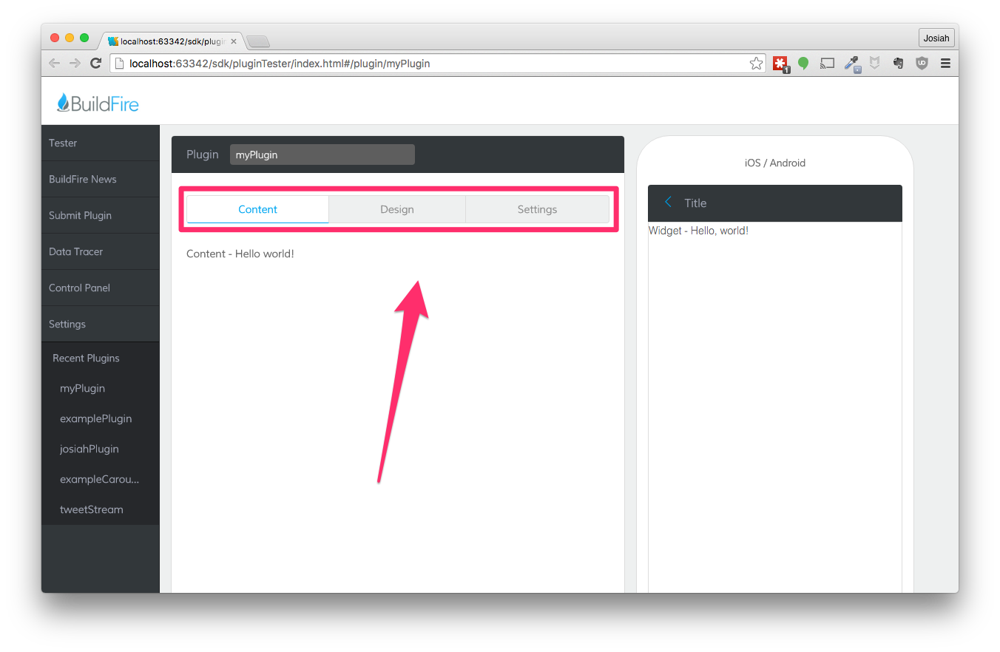

## Exploring MyPlugin

Let's understand the elements of a plugin using the BuildFire SDK. We will start by just opening the areas of the SDK and make sure we see the "Hello World" placed in the widget and explore the areas we will be using mostly.

### The Developer Dashboard

When we run the <code>index.html</code> in pluginTester, we will see two main sections of the Developer Dashboard:

#### 1. The Control

The control is where we see the different settings and configuration for the plugin.

There are three possible areas for the control:

##### a. Content

##### b. Design

##### c. Settings

It is up to us as the plugin creator to decide how best to have these configurations organized. We can choose to remove or activate these three sections depending on the type of plugin we are creating.

For example: BuildFire's text plugin only has the "content" area of the configuration enabled as there are not really "settings" or "design" changes you can make to it. It is just about adding the content to the plugin.

Conversely, the media center plugin does have the "design" area enabled as we have several different choices on how to display the data.

These decisions are really a judgement call on our part as to which of the areas we will utilize to have as the plugin configuration. We can make those changes of which configuration areas will be shown in the <code>plugin.json</code>, which we will touch on a little later in this post.

#### 2. The Emulator

The emulator is the preview or 'display' of our plugin and can be updated by the control. Ideally, as our users make changes in the control, the emulator will update to show the changes they have made. We could either update to show changes with a button, or an <code>onUpdate</code> handler.

### The SDK Plugin Folder (../BuildFireSDK/myPlugin)

We have already looked at this folder a little bit in past posts, but let's dive a bit deeper this time. 

#### 1. The Control Folder
The control folder dictates what the user sees on the left-hand side of the dashboard. Using the control area, the user will configure their unique plugin instance of the plugin we have created. The Control area of the app can have three sections; Content, Design, or Settings. We will find all three corresponding directories in this folder. For each area we use, we will need to write the template for the <code>index.html</code> of that directory.

#### 2. The Resources Folder
The Resource Folder is only for the default plugin icon and default image we may want in the plugin. This folder will not carry over any other resources for the plugin when it is submitted. **Note:** If we did need to add other resources to the plugin which *should* be included when the plugin is submitted, the correct place to do this is in the **Widget folder** or **Control folder**. The resources cannot be shared betweeen the widget and control folders, so it is important to include the resources we will be needing in the correct folder. 

#### 3. The Widget Folder
The widget folder is the actual functionality of the plugin which will live in the app. It displays the configuration of the plugin instance in the emulator on the right hand side of the dashboard and it is also what will actually be seen in the app. 

### 'Plugin.json' file

This file is where we can configure the plugin. It is similar to the <code>package.json</code> file for an npm package or a <code>.gemspec</code> file for a ruby gem. We will have the option to enable or disable the different areas of the control in this file. We will also add the details for the plugin like the author's name, the plugin name, the languages our plugin uses, and features of the plugin.

### Wrapping Up...
This is a basic overview of the different areas of the SDK. To dive further into the SDK, you can always check out the other posts or the [wiki](https://github.com/BuildFire/sdk/wiki) on github.

See this post on github [here]().
